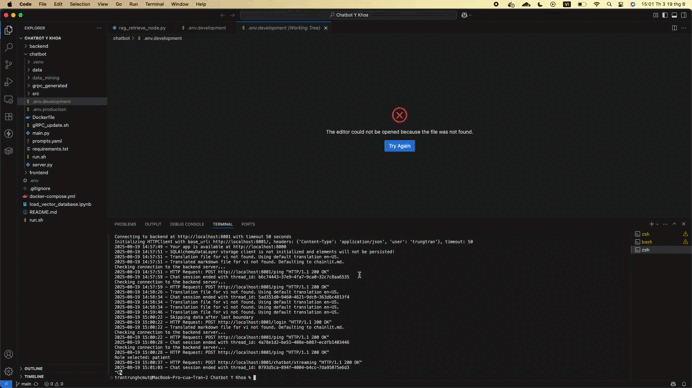

# Medical AI Chatbot 🏥🤖

A microservices-based medical AI chatbot application built for learning AI engineering principles and practices. This project demonstrates the complete pipeline from data preparation through RAG (Retrieval-Augmented Generation) model construction to DevOps deployment.

## 🏗️ Architecture Overview

This project implements a **microservices architecture** with the following components:

```
┌─────────────────┐    ┌─────────────────┐    ┌─────────────────┐
│    Frontend     │    │     Backend     │    │    Chatbot      │
│   (Chainlit)    │◄──►│    (FastAPI)    │◄──►│   (Langchain)   │
│   Port: 8000    │    │   Port: 8001    │    │   Port: 50051   │
└─────────────────┘    └─────────────────┘    └─────────────────┘
         │                       │                       │
         └───────────┬───────────┘                       ▼
                     ▼                         ┌─────────────────┐
         ┌─────────────────┐                   │     Milvus      │
         │   PostgreSQL    │                   │ (Vector Store)  │
         │ (Chat History)  │                   │   Port: 19530   │
         │   Port: 5432    │                   └─────────────────┘
         └─────────────────┘
```

### 🔧 Service Components

- **Frontend**: Chainlit-based conversation interface with PostgreSQL for session management
- **Backend**: FastAPI server acting as an intermediate control center between UI and chatbot
- **Chatbot**: Core AI processing service using Langchain framework with gRPC communication
- **PostgreSQL**: Relational database for conversation history storage
- **Milvus**: Vector database for embeddings and similarity search

## 🚀 Technology Stack

### **Core Frameworks**
- **Chainlit** - Interactive chat interface and conversation management
- **FastAPI** - High-performance backend API with automatic documentation
- **Langchain** - AI framework for building chatbot logic and RAG pipeline
- **Docker** - Containerization and microservices orchestration

### **AI/ML Components**
- **OpenAI API** - Text embeddings and causal language model
- **BGE-reranker-v3** - HuggingFace reranker model hosted locally
- **RAG Architecture** - Retrieval-Augmented Generation for context-aware responses

### **Databases**
- **PostgreSQL** - Conversation history and user session management
- **Milvus** - Vector database for semantic search and embeddings storage

### **Communication**
- **gRPC** - High-performance communication between backend and chatbot
- **REST API** - HTTP communication between frontend and backend

## 🩺 Chatbot Functionality

The Medical AI Assistant is specialized for healthcare information and medical Q&A:

### **Medical Knowledge Domains**
- Genetic and Rare Diseases
- Growth Hormone Disorders  
- Diabetes, Digestive, and Kidney Diseases
- Neurological Disorders and Stroke
- Cancer (various types and treatments)
- Heart, Lung, and Blood Disorders
- Senior Health and Age-related Conditions
- Disease Control and Prevention

### **Question Classification System**
Intelligent question type classification supporting:
- **Definitions** - Medical term explanations
- **Treatments** - Therapy and medication information
- **Risk Assessment** - Disease risk factors and prevention
- **Prognosis** - Disease outlook and recovery information
- **Comparisons** - Treatment/condition comparisons
- **Yes/No Queries** - Direct medical questions

### **Key Features**
- Evidence-based responses from 16,000+ medical Q&A pairs
- Context-aware conversation with history retention
- Structured response formatting for clarity
- Safety-focused with medical disclaimers

*Detailed Chatbot use case can be founded in [Chatbot Functionalities](/frontend/chainlit.md)*

## �️ Setup Instructions

### Prerequisites
- Docker and Docker Compose installed
- OpenAI API key

### Environment Configuration

Create a `.env` file in the project root directory with the following variables:

```bash
# OpenAI API Configuration
OPENAI_API_KEY=your_openai_api_key_here

# Docker Volume Configuration  
DOCKER_VOLUME_DIRECTORY=~

# Chainlit Authentication Secret (generate a secure random string)
CHAINLIT_AUTH_SECRET="your_secure_random_string_here"

# Hardware Configuration
DEVICE=cpu  # Options: cpu, cuda | For Macbook, Docker currently not support `mps` running
```

### Environment Variables Explanation

| Variable | Description | Example Value |
|----------|-------------|---------------|
| `OPENAI_API_KEY` | Your OpenAI API key for embeddings and language model | `sk-proj-...` |
| `DOCKER_VOLUME_DIRECTORY` | Directory for Docker volume mounting | `~` or `/path/to/volumes` |
| `CHAINLIT_AUTH_SECRET` | Secret key for Chainlit session authentication | Random 64-character string |
| `DEVICE` | Hardware device for AI model inference | `cpu`, `cuda`, `mps` |

### Where you can get `SECRET_KEY` ?
- *OpenAI API_KEY can be generated from: [OpenAI Platform](https://platform.openai.com/usage)*
- *Chainlit Secret Key can be created locally by command: `cd frontend/ && chainlit create-secret`*

### Loading vector database
After specify the `OPENAI_API_KEY` in `.env` file, you need to run all cells from notebook [load_vector_database.ipynb](/load_vector_database.ipynb) for downloading data and vectorize them into `Milvus Server`.

## �🐳 Docker Deployment

All services are containerized and orchestrated using Docker Compose:

```bash
# Start all services
docker-compose up -d

# View running services
docker-compose ps

# Check logs
docker-compose logs [service-name]
```

## 📁 Project Structure

```
├── frontend/           # Chainlit UI application
├── backend/           # FastAPI backend service  
├── chatbot/           # Core AI chatbot logic
├── docker-compose.yml # Services orchestration
└── README.md         # Project documentation
```

## 🎯 Learning Objectives

This internship project covers the complete AI engineering pipeline:

1. **Data Preparation** - Medical dataset processing and vectorization
2. **RAG Model Construction** - Building retrieval-augmented generation systems
3. **Microservices Architecture** - Designing scalable service-oriented systems
4. **DevOps Practices** - Containerization, orchestration, and deployment
5. **AI Model Integration** - Combining multiple AI models and APIs
6. **Database Management** - Both relational and vector database operations

--- 

# Usecase examples



---

⚠️ **Medical Disclaimer**: This chatbot is for educational purposes only. Always consult qualified healthcare professionals for medical advice.